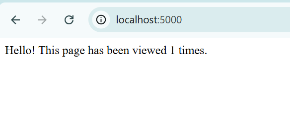

# 🚀 Flask + Redis App with Docker Compose

This is a simple Python Flask web application that tracks how many times the page has been viewed — backed by **Redis** for persistent counting.

It's fully containerized and orchestrated using **Docker Compose**.

## 🧰 Tech Stack

- 🐍 Python + Flask  
- 🗃️ Redis (key-value database)  
- 🐳 Docker & Docker Compose

## 🛠️ How to Run Locally

Clone the repository:

```
git clone https://github.com/charan17kk/docker-compose-flask-redis-demo.git
cd docker-compose-flask-redis-demo
```

Start the containers:

```
docker compose up
```

Open your browser and go to:

```
http://localhost:5000
```

Stop the app:

```
docker compose down
```

## 📁 Folder Structure

```
docker-compose-flask-redis-demo/
├── app/
│   ├── app.py
│   └── requirements.txt
├── Dockerfile
├── docker-compose.yml
├── README.md
├── screenshot.png
```

## 📸 Screenshot

> A simple web app counting page views using Flask + Redis:



## 💡 What I Learned

- How to write and build a `Dockerfile`  
- How containers communicate over Docker networks  
- How to orchestrate multi-container apps with `docker-compose`  
- Real-world project structure for DevOps-ready apps

## ✅ Status

Project complete ✅  
First of many real-world containerized apps in my DevOps journey.

